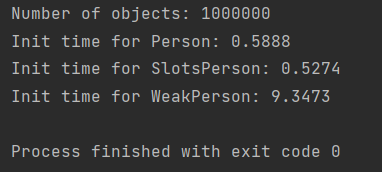
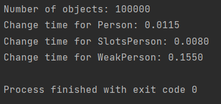

### Задание 1

1. Создание экземпляров

2. Изменение экземпляров

Как видно, слоты работают очевидно быстрее классов с обычными атрибутами. С weakref все сложнее:
для создания экземпляра тестируемого класса надо для каждого атрибута создать экземпляр вспомогательного класса,
поэтому времени требуется намного больше.

Такая же проблема и при изменении атрибутов: у класса WeakPerson изменение собственного атрибута ведет к
изменению атрибута объекта класса, на который ведет weakref.