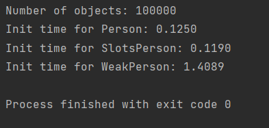

### Задание 1
1. Создание экземпляров

2. Изменение экземпляров

Как видно, слоты работают очевидно быстрее классов с обычными атрибутами. С weakref все сложнее:
для создания экземпляра тестируемого класса надо для каждого атрибута создать экземпляр вспомогательного класса,
поэтому времени требуется намного больше.

Такая же проблема и при изменении атрибутов: у класса WeakPerson изменение собственного атрибута ведет к
изменению атрибута объект класса, на который ведет weakref.

### Задание 2

В слотовом варианте памяти тратится меньше, поскольку не создается __dict__ с атрибутами экземпляра.
В то же самое время weakref требуют больше места. Это связано с тем, что слабые ссылки
занимают достаточно много места в памяти:
